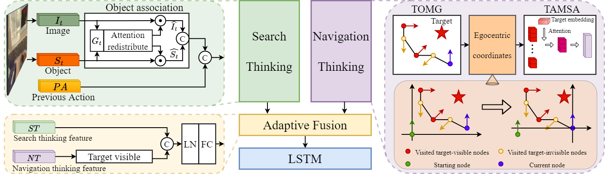

# Search for or Navigate to? Dual Adaptive Thinking for Object Navigation
Ronghao Dang, Liuyi Wang, Zongtao He, Shuai Su, Chengju Liu, Qijun Chen (Under review for AAAI 2023)

[Arxiv Paper](https://arxiv.org/abs/2208.00553)

<p align="center"></p>

## Abstract
“Search for” or “Navigate to”? When we find a specific object in an unknown environment, the two choices always arise in our subconscious mind. Before we see the target, we search for the target based on prior experience. After we have located the target, we remember the target location and navigate to this location. However, recent object navigation methods almost only consider using object association to enhance the “search for” phase while neglect the importance of the “navigate to” phase. Therefore, this paper proposes a dual adaptive thinking (DAT) method that flexibly adjusts the thinking strategies in different navigation stages. Dual thinking includes both search thinking according to the object association ability and navigation thinking according to the target location ability. To make the navigation thinking more effective, we design a target-oriented memory graph (TOMG) that stores historical target information and a target-aware multi-scale aggregator (TAMSA) that encodes the relative position of the target. We assess our methods on the AI2-Thor dataset. Compared with state-of-the-art (SOTA) methods, our approach achieves 10.8%, 21.5% and 15.7% increases in the success rate (SR), success weighted by path length (SPL) and success weighted by navigation efficiency (SNE), respectively.


## Setup
- Clone the repository `git clone https://github.com/Rh-Dang/DAT.git` and move into the top level directory `cd DAT`
- Create conda environment. `pip install -r requirements.txt`
- Download the [dataset](https://drive.google.com/file/d/1kvYvutjqc6SLEO65yQjo8AuU85voT5sC/view), which refers to [ECCV-VN](https://github.com/xiaobaishu0097/ECCV-VN). The offline data is discretized from [AI2-Thor](https://ai2thor.allenai.org/) simulator.
- Download the [pretrain dataset](https://drive.google.com/file/d/1dFQV10i4IixaSUxN2Dtc6EGEayr661ce/view), which refers to [VTNet](https://github.com/xiaobaishu0097/ICLR_VTNet).
- You can also use the [DETR object detection features](https://drive.google.com/file/d/1d761VxrwctupzOat4qxsLCm5ndC4wA-M/view?usp=sharing).
The `data` folder should look like this
```python
data/ 
    └── Scene_Data/
        ├── FloorPlan1/
        │   ├── resnet18_featuremap.hdf5
        │   ├── graph.json
        │   ├── visible_object_map_1.5.json
        │   ├── detr_features_22cls.hdf5
        │   ├── grid.json
        │   └── optimal_action.json
        ├── FloorPlan2/
        └── ...
    └── AI2Thor_VisTrans_Pretrain_Data/
        ├── data/
        ├── annotation_train.json
        ├── annotation_val.json
        └── annotation_test.json
``` 
## Training and Evaluation

### Pre-train the search thinking network of our DAT model

`python main_pretraining.py --title DAT_Pretrain --model DAT_Pretrain --workers 9 --gpu-ids 0 --epochs 20 --log-dir runs/pretrain --save-model-dir trained_models/pretrain`
### Train our DAT model
`python main.py --title DAT --model DAT --workers 9 --gpu-ids 0 --max-ep 3000000 --log-dir runs/RL_train --save-model-dir trained_models/RL_train --pretrained-trans trained_models/pretrain/checkpoint0004.pth` 
### Evaluate our DAT model
`python full_eval.py --title DAT --model DAT --results-json eval_best_results/DAT.json --gpu-ids 0 --log-dir runs/RL_train --save-model-dir trained_models/RL_train`  
## Citing
If you find this project useful in your research, please consider citing:
```
@article{dang2022search,
  title={Search for or Navigate to? Dual Adaptive Thinking for Object Navigation},
  author={Dang, Ronghao and Wang, Liuyi and He, Zongtao and Su, Shuai and Liu, Chengju and Chen, Qijun},
  journal={arXiv preprint arXiv:2208.00553},
  year={2022}
}
```
